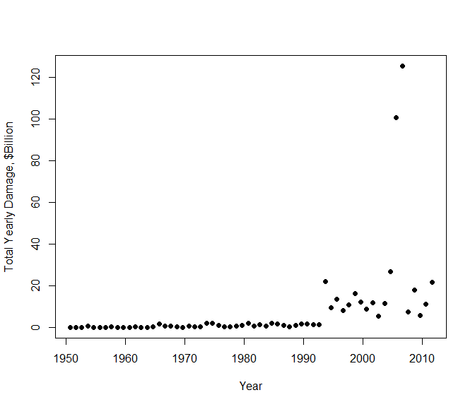

# The Economic and Population Health Impacts of Severe Weather Events
Michael M. Clark  
8/23/2014  

##Synopsis
This report describes an analysis of the U.S. National Oceanic and Atmospheric Administration's (NOAA) storm database to determine the effects of extreme weather events on population health and the economic consequences of extreme weather events. The storm database file was downloaded from the coursera website and more information about the file can be found at http://www.nws.noaa.gov/directives/. The database contains recorded information about extreme weather events, which includes number of fatalities, number of injuries, property damage and crop damage. We will consider fatalities and injuries to look at the impacts of extreme weather on population health, and then we will use the property and crop damage data to look at economic impacts.

##Data Processing
The data file was downloaded from the coursera website and then read into a data frame object in R. The date was converted to the Date data type, and then a variable "year" was added for later convenience in summarizing the data.


```r
require(reshape2)
require(data.table)

dfile <- "repdata-data-StormData.csv"

DT <- read.table(dfile, header=TRUE, sep=",")

DT$BGN_DATE <- as.Date(DT$BGN_DATE, format="%m/%d/%Y")
DT$year <- format(DT$BGN_DATE, format="%Y")
```

###List of Variables and Summary of Key Variables of Interest
A look at the names of the variables in the database shows all the variable types included. The top ten records of event fatalities, event injuries, and event property and crop damages are shown with the code below for exploration of the data.


```r
# Exploratory analysis
names(DT)
```

```
##  [1] "STATE__"    "BGN_DATE"   "BGN_TIME"   "TIME_ZONE"  "COUNTY"    
##  [6] "COUNTYNAME" "STATE"      "EVTYPE"     "BGN_RANGE"  "BGN_AZI"   
## [11] "BGN_LOCATI" "END_DATE"   "END_TIME"   "COUNTY_END" "COUNTYENDN"
## [16] "END_RANGE"  "END_AZI"    "END_LOCATI" "LENGTH"     "WIDTH"     
## [21] "F"          "MAG"        "FATALITIES" "INJURIES"   "PROPDMG"   
## [26] "PROPDMGEXP" "CROPDMG"    "CROPDMGEXP" "WFO"        "STATEOFFIC"
## [31] "ZONENAMES"  "LATITUDE"   "LONGITUDE"  "LATITUDE_E" "LONGITUDE_"
## [36] "REMARKS"    "REFNUM"     "year"
```

```r
head(sort(table(DT$FATALITIES), decreasing=TRUE), 10)
```

```
## 
##      0      1      2      3      4      5      6      7      8      9 
## 895323   5010    996    314    166    114     71     53     33     30
```

```r
head(sort(table(DT$INJURIES), decreasing=TRUE), 10)
```

```
## 
##      0      1      2      3      4      5      6      7     10      8 
## 884693   7756   3134   1552    931    709    529    280    271    255
```

```r
head(sort(table(DT$PROPDMGEXP), decreasing=TRUE), 10)
```

```
## 
##             K      M      0      B      5      1      2      ?      m 
## 465934 424665  11330    216     40     28     25     13      8      7
```

```r
head(sort(table(DT$CROPDMGEXP), decreasing=TRUE), 10)
```

```
## 
##             K      M      k      0      B      ?      2      m 
## 618413 281832   1994     21     19      9      7      1      1
```

###Converting Economic Data to Common Numeric Basis
We want to summarize the data set by year and event type. The economic data are given in various orders of magnitute with an exponential character indicating the order of magnitude (e.g. "K" representing 1,000s, "M" meaning 1,000,000s, etc.) The code below converts the economic damage variable to a common numeric basis for us to later summarize.


```r
# initialize three new variables to sum up $$ damage
DT$CROPS <- as.numeric(NA)
DT$PROP <- as.numeric(NA)
DT$TOTDMG <- as.numeric(NA)

# Convert property damage to absolute value, not the abbreviated value with the exponential symbol
irows <- which(DT$PROPDMGEXP=="" | DT$PROPDMGEXP=="0")
DT$PROP[irows] <- DT$PROPDMG[irows]*1e0
irows <- which(DT$PROPDMGEXP=="K" | DT$PROPDMGEXP=="3" | DT$PROPDMGEXP=="k")
DT$PROP[irows] <- DT$PROPDMG[irows]*1e3
irows <- which(DT$PROPDMGEXP=="m" | DT$PROPDMGEXP=="6" | DT$PROPDMGEXP=="M")
DT$PROP[irows] <- DT$PROPDMG[irows]*1e6
irows <- which(DT$PROPDMGEXP=="B" | DT$PROPDMGEXP=="9" | DT$PROPDMGEXP=="b")
DT$PROP[irows] <- DT$PROPDMG[irows]*1e9
irows <- which(DT$PROPDMGEXP=="H" | DT$PROPDMGEXP=="2")
DT$PROP[irows] <- DT$PROPDMG[irows]*1e2
irows <- which(DT$PROPDMGEXP=="1")
DT$PROP[irows] <- DT$PROPDMG[irows]*1e1
irows <- which(DT$PROPDMGEXP=="4")
DT$PROP[irows] <- DT$PROPDMG[irows]*1e4
irows <- which(DT$PROPDMGEXP=="5")
DT$PROP[irows] <- DT$PROPDMG[irows]*1e5
irows <- which(DT$PROPDMGEXP=="7")
DT$PROP[irows] <- DT$PROPDMG[irows]*1e7
irows <- which(DT$PROPDMGEXP=="8")
DT$PROP[irows] <- DT$PROPDMG[irows]*1e8

# Convert crops damage to absolute value, not the abbreviated value with the exponential symbol
irows <- which(DT$CROPDMGEXP=="" | DT$CROPDMGEXP=="0")
DT$CROPS[irows] <- DT$CROPDMG[irows]*1e0
irows <- which(DT$CROPDMGEXP=="K" | DT$CROPDMGEXP=="3" | DT$CROPDMGEXP=="k")
DT$CROPS[irows] <- DT$CROPDMG[irows]*1e3
irows <- which(DT$CROPDMGEXP=="m" | DT$CROPDMGEXP=="6" | DT$CROPDMGEXP=="M")
DT$CROPS[irows] <- DT$CROPDMG[irows]*1e6
irows <- which(DT$CROPDMGEXP=="B" | DT$CROPDMGEXP=="9" | DT$CROPDMGEXP=="b")
DT$CROPS[irows] <- DT$CROPDMG[irows]*1e9
irows <- which(DT$CROPDMGEXP=="H" | DT$CROPDMGEXP=="2" | DT$CROPDMGEXP=="h")
DT$CROPS[irows] <- DT$CROPDMG[irows]*1e2
irows <- which(DT$CROPDMGEXP=="1")
DT$CROPS[irows] <- DT$CROPDMG[irows]*1e1
irows <- which(DT$CROPDMGEXP=="4")
DT$CROPS[irows] <- DT$CROPDMG[irows]*1e4
irows <- which(DT$CROPDMGEXP=="5")
DT$CROPS[irows] <- DT$CROPDMG[irows]*1e5
irows <- which(DT$CROPDMGEXP=="7")
DT$CROPS[irows] <- DT$CROPDMG[irows]*1e7
irows <- which(DT$CROPDMGEXP=="8")
DT$CROPS[irows] <- DT$CROPDMG[irows]*1e8
```

###Creating Summaries by Event Type and Year
Next we created summaries of the key data by event type and year. These summaries will be used later to explain the results of the analysis.


```r
# Sum up crops and property damage for all events
DT$TOTDMG <- DT$CROPS + DT$PROP

#Summary of total damage (Crops & Property, in Billion $$) by event type
TDMGbyType <- aggregate(TOTDMG ~ EVTYPE, DT, sum)
TDMGbyType <- TDMGbyType[order(TDMGbyType$TOTDMG, decreasing=TRUE),]
row.names(TDMGbyType) <- NULL
TDMGbyType$TOTDMG <- round(TDMGbyType$TOTDMG/1e9, 2)
#head(TDMGbyType, 10)

nlist1 <- as.character(TDMGbyType$EVTYPE[1:20])
nlist1 <- c(nlist1, "ALL OTHER EVENT TYPES")
yvals1 <- c(TDMGbyType$TOTDMG[1:20], sum(TDMGbyType$TOTDMG[21:nrow(TDMGbyType)]))

#Summary of property damage (in Billion $$) by event type
PDMGbyType <- aggregate(PROP ~ EVTYPE, DT, sum)
PDMGbyType <- PDMGbyType[order(PDMGbyType$PROP, decreasing=TRUE),]
row.names(PDMGbyType) <- NULL
PDMGbyType$PROP <- round(PDMGbyType$PROP/1e9, 2)
#head(PDMGbyType, 10)

#Summary of crop damage (in Billion $$) by event type
CTDMGbyType <- aggregate(CROPS ~ EVTYPE, DT, sum)
CTDMGbyType <- CTDMGbyType[order(CTDMGbyType$CROPS, decreasing=TRUE),]
row.names(CTDMGbyType) <- NULL
CTDMGbyType$CROPS <- round(CTDMGbyType$CROPS/1e9, 2)
#head(CTDMGbyType, 10)

#Summary of total damage by year, all events
YearlyDMG <- aggregate(TOTDMG ~ year, DT, sum)
YearlyDMG <- YearlyDMG[order(YearlyDMG$TOTDMG, decreasing=TRUE),]
row.names(YearlyDMG) <- NULL
YearlyDMG$year  <- as.Date(YearlyDMG$year, format="%Y")
YearlyDMG$TOTDMG <- YearlyDMG$TOTDMG/1e9

#Summary of effect on population health (deaths and injuries)
#Fatalities
EventFatalities <- aggregate(FATALITIES ~ EVTYPE, DT, sum)
EventFatalities <- EventFatalities[order(EventFatalities$FATALITIES, decreasing=TRUE),]
row.names(EventFatalities) <- NULL
#head(EventFatalities, 10)

#nlist <- as.character(EventFatalities$EVTYPE[1:20])
#nlist <- c(nlist, "ALL OTHER EVENT TYPES")
#yvals <- c(EventFatalities$FATALITIES[1:20], sum(EventFatalities$FATALITIES[21:nrow(EventFatalities)]))
#barplot(yvals, names.arg=nlist, horiz=TRUE, las=1)

YearlyFatalities <- aggregate(FATALITIES ~ year, DT, sum)
YearlyFatalities <- YearlyFatalities[order(YearlyFatalities$FATALITIES, decreasing=TRUE),]
row.names(YearlyFatalities) <- NULL
YearlyFatalities$year  <- as.Date(YearlyFatalities$year, format="%Y")
#plot(YearlyFatalities$year, YearlyFatalities$FATALITIES)

#Injuries
EventInjuries <- aggregate(INJURIES ~ EVTYPE, DT, sum)
EventInjuries <- EventInjuries[order(EventInjuries$INJURIES, decreasing=TRUE),]
row.names(EventInjuries) <- NULL
#head(EventInjuries, 10)

#nlist <- as.character(EventInjuries$EVTYPE[1:20])
#nlist <- c(nlist, "ALL OTHER EVENT TYPES")
#yvals <- c(EventInjuries$INJURIES[1:20], sum(EventInjuries$INJURIES[21:nrow(EventInjuries)]))

YearlyInjuries <- aggregate(INJURIES ~ year, DT, sum)
YearlyInjuries <- YearlyInjuries[order(YearlyInjuries$INJURIES, decreasing=TRUE),]
row.names(YearlyInjuries) <- NULL
YearlyInjuries$year  <- as.Date(YearlyInjuries$year, format="%Y")
#head(YearlyInjuries, 10)

#Sum injuries + fatalites for events
DT$TOTFI <- DT$FATALITIES + DT$INJURIES
EventTot <- aggregate(TOTFI ~ EVTYPE, DT, sum)
EventTot <- EventTot[order(EventTot$TOTFI, decreasing=TRUE),]
row.names(EventTot) <- NULL
#head(EventTot, 10)

nlistFI <- as.character(EventTot$EVTYPE[1:20])
nlistFI <- c(nlistFI, "ALL OTHER EVENT TYPES")
yvalsFI <- c(EventTot$TOTFI[1:20], sum(EventTot$TOTFI[21:nrow(EventTot)]))
```

##Results
The economic and health impacts of extreme weather events are summarized here.

###Effect on Population Health
Extreme weather effects on poplulation health were measured by injuries and fatalities. Top ten summaries of number of fatalities and injuries by event type are tabulated below.


```r
head(EventInjuries, 10)
```

```
##               EVTYPE INJURIES
## 1            TORNADO    91346
## 2          TSTM WIND     6957
## 3              FLOOD     6789
## 4     EXCESSIVE HEAT     6525
## 5          LIGHTNING     5230
## 6               HEAT     2100
## 7          ICE STORM     1975
## 8        FLASH FLOOD     1777
## 9  THUNDERSTORM WIND     1488
## 10              HAIL     1361
```

```r
head(EventFatalities, 10)
```

```
##            EVTYPE FATALITIES
## 1         TORNADO       5633
## 2  EXCESSIVE HEAT       1903
## 3     FLASH FLOOD        978
## 4            HEAT        937
## 5       LIGHTNING        816
## 6       TSTM WIND        504
## 7           FLOOD        470
## 8     RIP CURRENT        368
## 9       HIGH WIND        248
## 10      AVALANCHE        224
```
A look at the of combined injuries plus fatalities by event type is given in the following bar plot. We see that tornados by far are responsibile for the greatest impact on poplulation health as measured by reported injuries and fatalites. Excessive heat, thunderstorms with wind, floods, and lightning round out the top five.


```r
par(mar=c(5, 13, 3, 1)+0.1)
barplot(yvalsFI, names.arg=nlistFI, horiz=TRUE, las=1, xlab="Fatalities + Injuries", 
        main="Total Fatalities and Injuries by Weather Event Type, 1950-2011",
        cex.main=0.8)
```

 

###Economic Impacts
Extreme weather effects on the economy were measured by reported damage to property and crops. The following barplot summarizes the combined total of crops and property damage by event type. The top five are floods, hurricanes, tornados, storm surge, and hail.


```r
par(mar=c(5, 14, 3, 1)+0.1)
barplot(yvals1, names.arg=nlist1, horiz=TRUE, las=1, xlab="$Billion", 
        main="Total Crops and Property Damage by Weather Event Type, 1950-2011",
        cex.main=0.8)
```

 

Below is a plot of total damage by year. It indicates that the reported damages caused by extreme weather events has generally been higher over the last two decades than in the previous four decades.


```r
par(mar=c(5, 4, 4, 2)+0.1)
plot(YearlyDMG$year, YearlyDMG$TOTDMG, ylab="Total Yearly Damage, $Billion", xlab="Year", pch=16)
```

 

